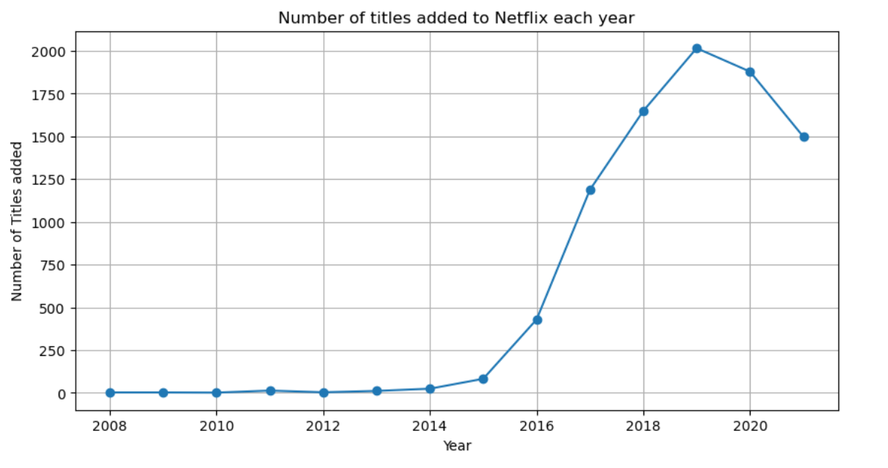
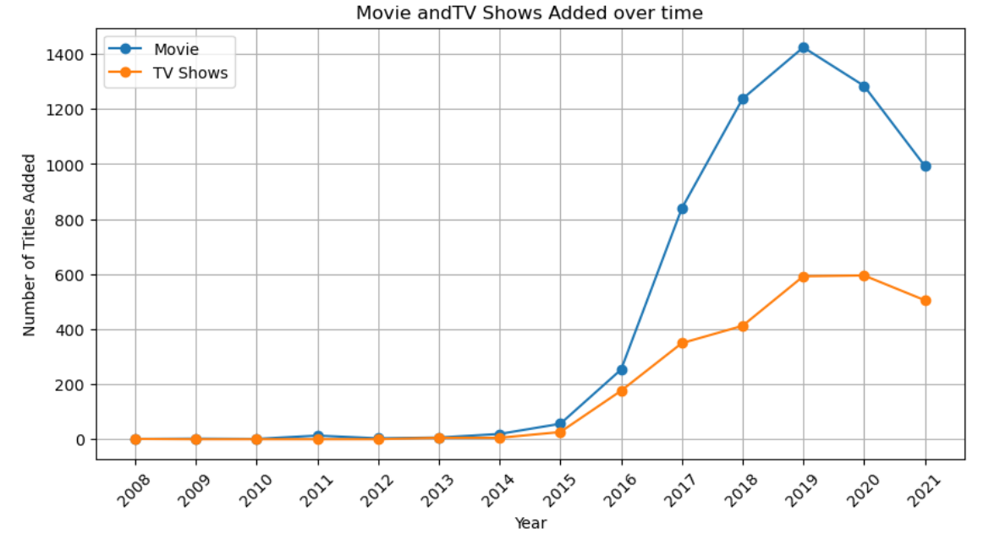
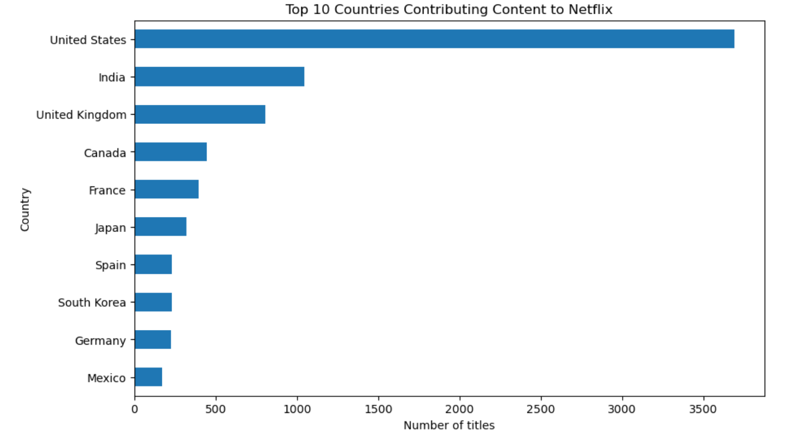
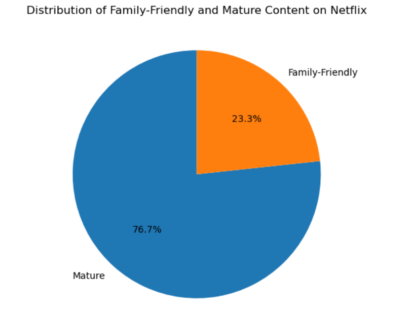
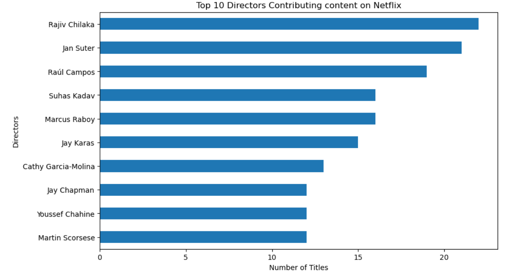
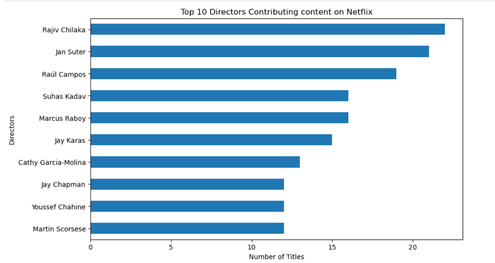
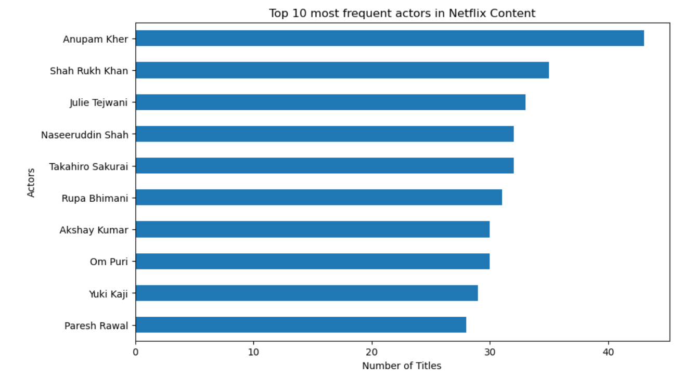

::: {align="center"}
# 🎬 Netflix Content Strategy Analysis

### Business-Driven Exploratory Data Analysis using Python


:::

------------------------------------------------------------------------

## 📖 Project Overview

Netflix is one of the world's largest streaming platforms with thousands
of movies and TV shows from different countries and creators.

This project performs a **business-oriented Exploratory Data Analysis
(EDA)** to understand Netflix's content strategy by answering practical
business questions rather than simply creating charts.

The analysis demonstrates the complete workflow of a Data Analyst---from
cleaning raw data to generating actionable business insights.

------------------------------------------------------------------------

# 🎯 Business Problem

**How has Netflix built its content library over time, and what insights
can support future content acquisition, production planning, and
audience targeting?**

------------------------------------------------------------------------

# 📂 Dataset

**Dataset:** Netflix Movies and TV Shows

  Attribute      Description
  -------------- -----------------------
  Type           Movie / TV Show
  Title          Content Name
  Director       Director(s)
  Cast           Actors
  Country        Production Country
  Date Added     Date Added to Netflix
  Release Year   Original Release Year
  Rating         Audience Rating
  Duration       Runtime / Seasons
  Listed In      Genres

------------------------------------------------------------------------

# 🛠️ Tech Stack

-   Python
-   Pandas
-   NumPy
-   Matplotlib
-   Jupyter Notebook
-   Git & GitHub

------------------------------------------------------------------------

# 📊 Analysis Workflow

``` text
Raw Dataset
     │
     ▼
Data Cleaning
     │
     ▼
Exploratory Data Analysis
     │
     ▼
Business Questions
     │
     ▼
Visualizations
     │
     ▼
Business Insights
     │
     ▼
Recommendations
```

------------------------------------------------------------------------

# ❓ Business Questions

-   Has Netflix's content library grown over time?
-   Has Netflix shifted from Movies to TV Shows?
-   Which countries contribute the most content?
-   Which genres dominate the platform?
-   Does Netflix focus more on mature or family-friendly content?
-   Which directors contribute the most titles?
-   Which actors appear most frequently?

------------------------------------------------------------------------

# 📈 Key Findings

-   Rapid expansion of Netflix's content library over time.
-   Movies remain the dominant content type.
-   The United States and India contribute the highest number of titles.
-   International Movies, Dramas, and Comedies dominate the catalog.
-   Mature-rated content forms the majority of the library.
-   Netflix collaborates repeatedly with several well-known actors and
    directors.
-   The platform follows a globally diversified content strategy.

------------------------------------------------------------------------

# 💼 Business Recommendations

-   Expand investments in emerging content markets.
-   Continue strengthening high-performing genres.
-   Increase family-friendly content to broaden audience reach.
-   Maintain relationships with successful creators while discovering
    new talent.

------------------------------------------------------------------------

# 📸 Visualizations

Replace the placeholders below with screenshots from the **images/**
folder after uploading them.

  Visualization        Preview
  -------------------- ---------------------------------------
  Content Growth       
  Movies vs TV Shows   
  Top Countries        
  Top Genres           
  Content Ratings      
  Top Directors        
  Top Actors           

------------------------------------------------------------------------

# 📁 Repository Structure

``` text
Netflix-Content-Strategy-Analysis/
│
├── data/
│   └── netflix_titles.csv
│
├── notebook/
│   └── Netflix_EDA.ipynb
│
├── images/
│
├── README.md
├── requirements.txt
└── LICENSE
```

------------------------------------------------------------------------

# ⚠️ Limitations

-   No user watch history or engagement metrics.
-   No revenue or subscription data.
-   Missing values in some metadata.
-   Analysis is descriptive rather than predictive.

------------------------------------------------------------------------

# 🚀 Future Improvements

-   Interactive Power BI Dashboard
-   Tableau Dashboard
-   Content-Based Recommendation System
-   IMDb Integration
-   Multi-platform Streaming Comparison
-   Predictive Analytics

------------------------------------------------------------------------

# ⭐ Skills Demonstrated

-   Data Cleaning
-   Exploratory Data Analysis
-   Data Visualization
-   Business Analysis
-   Insight Generation
-   Storytelling with Data
-   Git & GitHub

------------------------------------------------------------------------

# 👤 Author

**Srimayi Golajapu**

Aspiring Data Analyst \| Python \| SQL \| Data Visualization \| Machine
Learning

> If you found this project useful, consider giving the repository a ⭐.
